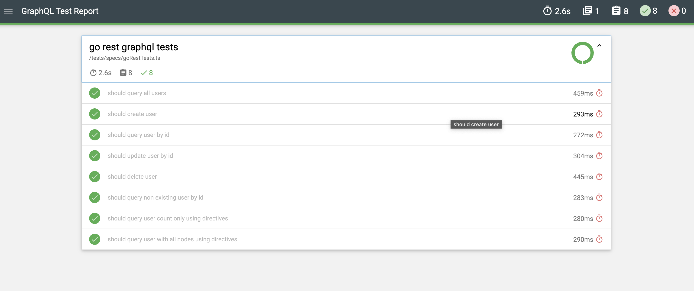

# GraphQL Test Automation framework
Boilerplate graphql test framework using Mocha, SuperTest and TypeScript.

### Pre-requisite:
[](https://nodejs.org/en/download/)
[](https://code.visualstudio.com/download)

### Getting Started

Clone Repository

```bash
git clone https://github.com/sadabnepal/graphql-supertest-api.git
cd graphql-supertest-api
```

Install packages:

```bash
npm install
```

Setup user token:
```bash
- Open the URL 'https://gorest.co.in/'
- Login or Sign
- Click on Login user drop down --> Access Token --> Copy token
- Create .env file in root project folder
- paster actual token `GO_RES_USER_TOKEN=<your_token_goes_here>`, refer .env.example file
```

Setup husky:

```bash
npm run prepare
```

Run tests:

```bash
npm run test
```

Lint & fix:

```bash
npm run lint
npm run lint:fix
```

Github Actions :<br> <br>
Currently test is setup to execute in github action on push event. You need to [create github secrete](https://docs.github.com/en/actions/security-guides/using-secrets-in-github-actions#creating-secrets-for-a-repository) with name `API_TOKEN` and value generated in `Setup user token` step. <br> <br>

<b> Github Permission to update report: </b> Go to Repository -> Settings -> Actions -> General <br>
Scroll to bottom of the page and look for 'Workflow permissions' section <br>
Check 'Read and write permission' and click on save

Sample Report


### Features:
    - Supertest library
    - Mocha framework to organize tests
    - Mochawesome report integration with logs
    - Custom types for better code intellisense
    - Github Action integration
    - Lint for better code quality
    - Husky for auto lint check before code commit
    - Manage secretes using dotenv library
    - Runtime dynamic test data generation using faker js library

### Tech stacks:
[](https://www.npmjs.com/package/supertest)
[](https://www.npmjs.com/package/supertest)
[](https://www.typescriptlang.org/)
[](https://mochajs.org/)
[](https://www.chaijs.com/)
[](https://github.com/features/actions)
[]([https://www.docker.com/](https://typescript-eslint.io/))
[]([https://www.docker.com/](https://typicode.github.io/husky/))

### learning references:
| topic           | references                                                  |
|-----------------|-------------------------------------------------------------|
| GraphQL         | https://graphql.org/learn                                   |
| SuperTest       | https://github.com/ladjs/supertest#readme                   |
| Mocha           | https://ricostacruz.com/mocha/                              |
| Mocha config    | https://github.com/mochajs/mocha/tree/master/example/config |
| TS style guide  | https://google.github.io/styleguide/tsguide.html            |
| ChaiJs          | https://www.chaijs.com                                      |
| Mochawesome     | https://github.com/adamgruber/mochawesome                   |
| DotEnv          | https://www.npmjs.com/package/dotenv                        |
| Eslint          | https://eslint.org/docs/latest/use/getting-started          |
| Husky           | https://typicode.github.io/husky/                           |
| VScode settings | https://code.visualstudio.com/docs/getstarted/settings      |


### GraphQL Topics to Explore
 - [x] basics of GraphQL (query, mutation)
 - [ ] advance topics (fragments, directive, unions, aliases)
 - [ ] parameterize query with arguments and variables
 - [ ] setting default variable
 - [ ] variables inside fragments
 - [ ] use of directive to build dynamic/reusable query
 - [ ] fields in query vs fields in mutation
 - [ ] inline fragments (unions)
 - [ ] meta fields (fetch type of field __typename)